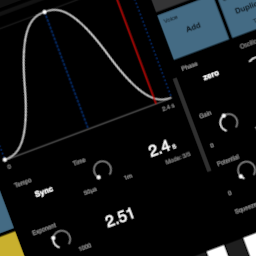

# Devoured pathways and friendly technology
My life has had many miraculous twists and turns. Today I am a father of two lovely daughters, living a model family life in the countryside just beyond the city gates. I work as consultant, project manager and software developer for Intuity Media Labs. I used to be a rebel, musician, physicist, designer, workaholic, dropout, hippie, activist, punk, artist and philosopher.

As a skeptical person, I ask myself why individuals are usually so convinced of themselves and their model of reality. The facts are quite simple, a single person is lovable at best, but only together and over time we came up with all the wonderful achievements surrounding us today. The more ideas are exchanged, the faster innovation progresses. I believe we are essentially explorers, not inventors. Publishing source code and providing free Software is a contribution to the interhuman spirit of innovation. Praise the anthroposphere and overcome its downsides.

# Contact
Feel free to contact me via these channels.
[LinkedIn](https://www.linkedin.com/in/c-nicholas-schreiber-079924281/)
[Discord](https://discord.com/channels/1275008575365840906/1275008774658326569)

# Audio
I've been making electronic music since the 90s, I learnt to code, why not try to develop my own musical instruments? I wrote a number of Flash synthesizers and sequencers during the 2000's. Subsequently, there were a few excursions into the world of open source audio libraries, frameworks and tools. Sometimes really annoying. Listed here some of my more recent web audio experiments.

## AWSM MKII
The second Version of the *AwesomeWaveSplineMachine*. Modular software synthesizer that utilizes dynamic WaveSpline synthesis.

[AWSM MKII repository](https://github.com/rnd7/awsm-mkii)

[AWSM MKII online](https://rnd7.github.io/awsm-mkii/dist/index.html)

## AWSM 
AwesomeWaveSplineMachine. WaveSpline synthesis software drone synthesizer. Building on the experience gained with CVS1.

[AWSM repository](https://github.com/rnd7/awsm)

[AWSM online](https://rnd7.github.io/awsm/dist)

## cvs1
Computational audio synthesis proof of concept.

[cvs1 repository](https://github.com/rnd7/cvs1)

[cvs1 online](https://rnd7.github.io/cvs1)

## rndmsc
More or less random music. This was my first attempt to make music with nothing but JavaScript. Back then, I wrote a whole series of similar programms all based on the same pattern. This is the only demo that has survived.

[rndmsc repository](https://github.com/rnd7/rndmsc)

[rndmsc online](https://rnd7.github.io/rndmsc)

## ctrl
Generic user interface component designed to interact with synthesizers or other realtime applications. I used these to fiddle around with the parameters of different otherwise hard-coded audio installations.

[ctrl repository](https://github.com/rnd7/ctrl)

[ctrl online](https://rnd7.github.io/ctrl)

# Video
Together with the beloved mother of my children Aimee Slickers, I realized various different Video Installations, primarily using the pseudonym Lux & Lucid. All the tools listed here emerged from these projects and are purpose build. Most of them were only intended to perform one specific task for one occasion. Even if designed as disposable software, some were reused several times. Here is a list of the browser based tools.

## Lux & Lucid solaire
2+1 Channel Video Mixer

[solaire repository](https://github.com/rnd7/solaire)

## Lux & Lucid iris
Video Mandala Mixer with audio trigger and spectrum visualization.

[iris repository](https://github.com/rnd7/iris)

## Lux & Lucid Emerald
Image Slideshow Tool with basic projection mapping capabilities.

[emerald repository](https://github.com/rnd7/emerald)

## Lux & Lucid VideoMapper
Single Surface Video Projection Mapper

[VideoMapper repository](https://github.com/rnd7/video-mapper)

### Lux & Lucid Infinite
Infinite Zoom Application

[infinite repository](https://github.com/rnd7/infinite)

# Web applications

## Sana Emiolechi
Custom made image gallery that can be hosted freely on github. I don't have insta. So I created this to share images of a personal photo project with people I know.

Update: Today I have Instagram, but still don't like it.

[Sana Emiolechi repository](https://github.com/rnd7/sana-emiolechi)

[Sana Emiolechi online](https://rnd7.github.io/sana-emiolechi)

## Weather Board
You can collaborate in real time on writing slowly fading poems using this tool. You might also use it for anonymous chat purposes and even script it to write weird messages repeatedly. In urgent cases you can roll your own server in just ten seconds. An art project in terms of its objective.

[weather-board repository](https://github.com/rnd7/weather-board)

## Molehill
Molehill is a Webcrawler for repetitive data mining and dataset unification purposes. I needed something like this for a data mining task, I had a bit of time, so I wrote it.

[Molehill repository](https://github.com/rnd7/molehill)

# Random times infinity
These are some of my digtal art projects that generate visual output while not being useful in any other means. JS Edition.

## modulateur
Fun with GLSL. Multiple Shader Passes modulating their own output.

[modulateur repository](https://github.com/rnd7/modulateur)

[modulateur online](https://rnd7.github.io/modulateur)

## ssi
Sub Sample Impressionist

[ssi repository](https://github.com/rnd7/ssi)

[ssi online](https://rnd7.github.io/ssi)

## mycelium
Growing mycelium

[mycelium repository](https://github.com/rnd7/mycelium)

[mycelium online](https://rnd7.github.io/mycelium)

# Demos
Some tech demos I once coded. Most of them are from my outdated
[goldsource](http://goldsource.de/) website, I have not touched these in a decade.

## frtr
Fractal trees for JavaScript.

[frtr repository](https://github.com/rnd7/frtr)

[frtr online](https://rnd7.github.io/frtr)

## Elastic Relaxation
Canvas Bezier Movement Tech Demo

[Elastic Relaxation repository](https://github.com/rnd7/elastic-relaxation)

[Elastic Relaxation online](https://rnd7.github.io/elastic-relaxation)

## Amoeba
An attempt to imitate the movements of an amoeba

[Amoeba repository](https://github.com/rnd7/amoeba)

[Amoeba online](https://rnd7.github.io/amoeba)

## bwps
Polygon Smoothing Algorithm

[bwps repository](https://github.com/rnd7/bwps)

[bwps example](https://rnd7.github.io/bwps)

## Kinetic Trees
Dynamic dragable branches with Javascript and THREE.js

[Kinetic Trees repository](https://github.com/rnd7/kinetic-trees)

[Kinetic Trees online](https://rnd7.github.io/kinetic-trees)

## g4p
Gravity for Particles. I today consider it a toy, but it was a fun project learning JS.

[g4p repository](https://github.com/rnd7/g4p)

[g4p online](https://rnd7.github.io/g4p)

## blast
Simple Asteroids Clone written in JS. This was one my first attempts to write JS code.

[blast repository](https://github.com/rnd7/blast)

[blast online](https://rnd7.github.io/blast)

## fatty
Bounce on a line tech demo.

[fatty repository](https://github.com/rnd7/fatty)

[fatty online](https://rnd7.github.io/fatty)

# Arduino
Some Arduino projects. Unfortunately the documentation is as crappy as the photos I took.

## midileaf
Plant MIDI Interface. Listen to the sounds of your potted plant. Part of an art installation of Katharina Kenklies.

[midileaf repository](https://github.com/rnd7/midileaf)

## yardstick
Simple program to measure and display distance as part of a project of Daniel Kocyba.

[yardstick repository](https://github.com/rnd7/yardstick)
