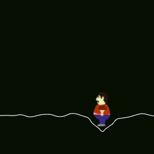

# About
Welcome fellow. Take a seat and enjoy the show. Back in 2018 I decided to dedicate some of my private software projects to the public and uploaded those to GitHub. I liked the idea and continued contributing. GitHub is my favorite free web hosting solution. Whenever I find time for a side project it is likely that it ends up here. Some repos might not be that interesting, some are really dusty, so here's a curated list of a selection I think is worth checking out.

# Pathways and belove technology
Somehow I always find it a bit disturbing to write about myself, but I take the opportunity to do so. Let's make it sound cool.

Since I got my first Computer in 1992 I am passionate about digital creation. I gathered a variety of different skills at different levels. I produced music, designed and illustrated print and screen media, filmed and produced videos, modeled and animated in all dimensions and finally wrote uncountable Lines of code. 

I started to work as professional Screen and UI Designer way back in 2005 after I canceled my physics studies. Because I already had some coding experience and due to the increasing demand for Web Developers during the Web 2.0 hype, it did not take long to shift my focus. Until 2012 I worked as employee and freelancer in various projects for different more or less well known companies and end customers. 

After 7 years of intense work I felt exhausted and decided to take a break for the next 7 years. In the end it were just 2 years, but these were great. During this period I read, learned, gardened and handcrafted. I lived without anything except what fitted in my backpack. I even tried to get along without spending money. Particularly the last point is really hard to achieve. Since a laptop fits in a backpack, I also coded a bit, mainly for the sake of fine arts. Then there was an opportunity to work on an interesting project and I considered to work part time as software developer again, while still keeping the balance living remote on my "Wagenplatz".

A bit later I joined a small startup based in Kiel focussed on projection mapping solutions. Meanwhile this company specialized in Video Software and Hardware, Cloud Services and the necessary infrastructure. We established an easy to use, remote controlled, offline capable, IoT Media Playback system for artists and PoS marketing experts that is used throughout different industries. It was a great time and I'm a bit proud of what we've achieved.

Today I'm in my early forties, became father of two children and live in an apartment with way more stuff than fits in a backpack. I work for a UI/UX agency in Hamburg focussed on the concept and design of physical user interfaces in the industrial design sector.

Since probably more than 25 years I actively observe how technology emerges and vanishes again. I'm trying to keep up. I love web technology and became a bit obsessed with ES6, even though I am not overly opinionated. In more recent years I also had a good time writing C code that runs on micro controllers and embedded systems, writing Webservices with Golang, or GLSL Shaders for super fancy VFX. I've always been a bit annoyed writing Java apps for Android devices, but you take what you get. Before that I enjoyed developing QT Apps, regardless of the licenses, had fun with Python and learned to hate PHP, I guess I should tryout a more recent version someday. I also discovered how to handle three dimensions using Blender, Unity or the UDK and how to wrangle realtime audio and video data. I learned to speak Linux more and more fluently and how to setup a server or configure some cloud to act like one. There is also a distant past in which I wrote Flash applications, struggled with html frames and fiddled around with Perl, Pascal and even Basic. I have to admit I'm happy about where we are today.

# Audio
I love making music and and I enjoy writing software that can be used for this. I wrote a number of Flash synthesizers and step sequencers during the 2000's. Although widely hated, I liked this technology as a way of bringing interactive multimedia experiences to the web long before anything comparable could be done with JavaScript. Listed here some of my more recent web audio experiments.

## AWSM 
AwesomeWaveSplineMachine. WaveSpline synthesis software synthesizer building on the experience gained with cvs1.

[AWSM repository](https://github.com/rnd7/awsm)

[AWSM online](https://rnd7.github.io/aws/dist)

## cvs1
Computational audio synthesis proof of concept.

[cvs1 repository](https://github.com/rnd7/cvs1)

[cvs1 online](https://rnd7.github.io/cvs1)

## rndmsc
More or less random music. This was my first attempt to make music using nothing but JavaScript.

[rndmsc repository](https://github.com/rnd7/rndmsc)

[rndmsc online](https://rnd7.github.io/rndmsc)

## ctrl
Generic user interface component designed to interact with synthesizers or other realtime applications. I used these to fiddle around with the parameters of different otherwise hard-coded audio installations.

[Repository](https://github.com/rnd7/ctrl)

[Application](https://rnd7.github.io/ctrl)

# Video
Together with the beloved mother of my children Aimee Slickers, I realized quite a lot of different Video Installlations under the pseudonym Lux & Lucid. The tools listed here all emerged from these projects. All are purpose build and most of them were only intended to perform one specific task for one occasion. Even if designed as disposable software, some still could be reused.

## Lux & Lucid solaire
2+1 Channel Video Mixer

[solaire repository](https://github.com/rnd7/solaire)

## Lux & Lucid iris
Video Mandala Mixer

[iris repository](https://github.com/rnd7/iris)

## Lux & Lucid Emerald
Image Slideshow Tool with basic projection mapping capabilities.

[emerald repository](https://github.com/rnd7/emerald)

## Lux & Lucid VideoMapper
Single Surface Video Projection Mapper

[Repository](https://github.com/rnd7/video-mapper)

### Lux & Lucid Infinite
Infinite Zoom Application

[infinite repository](https://github.com/rnd7/infinite)

# Web applications

## Sana Emiolechi
Custom made image gallery that can be hosted freely on github. I don't have insta. So I created this to share images of a personal photo project with people I know.

[Sana Emiolechi repository](https://github.com/rnd7/sana-emiolechi)

[Sana Emiolechi online](https://rnd7.github.io/sana-emiolechi)

## Weather Board
You can collaborate in real time on writing slowly fading poems using this tool. You might also use it for anonymous chat purposes and even script it to write weird messages repeatedly. In urgent cases you can roll your own server in just ten seconds.

[weather-board repository](https://github.com/rnd7/weather-board)

## Molehill
Molehill is a Webcrawler for repetitive data mining and dataset unification purposes. I needed something like this for a data mining task, I had a bit of time, so I wrote it.

[Molehill repository](https://github.com/rnd7/molehill)

# Random to infinity
These are some of my digtal art projects that generate visual output while not being useful in any other means.

## modulateur
Fun with GLSL. Multiple Shader Passes modulating their own output.

[modulateur repository](https://github.com/rnd7/modulateur)

[modulateur online](https://rnd7.github.io/modulateur)

## ssi
Sub Sample Impressionist

[ssi repository](https://github.com/rnd7/ssi)

[ssi online](https://rnd7.github.io/ssi)

## mycelium
Growing mycelium

[mycelium repository](https://github.com/rnd7/mycelium)

[mycelium online](https://rnd7.github.io/mycelium)

# Demos
Some tech demos I once coded. Most of them are from my outdated
[goldsource](http://goldsource.de/) website, I have not touched these in a decade.

## frtr
Fractal trees for JavaScript.

[frtr repository](https://github.com/rnd7/frtr)

[frtr online](https://rnd7.github.io/frtr)

## Elastic Relaxation
Canvas Bezier Movement Tech Demo

[Elastic Relaxation repository](https://github.com/rnd7/elastic-relaxation)

[Elastic Relaxation online](https://rnd7.github.io/elastic-relaxation)

## Amoeba
An attempt to imitate the movements of an amoeba

[Amoeba repository](https://github.com/rnd7/amoeba)

[Amoeba online](https://rnd7.github.io/amoeba)

## bwps
Polygon Smoothing Algorithm

[bwps repository](https://github.com/rnd7/bwps)

[bwps example](https://rnd7.github.io/bwps)

## Kinetic Trees
Dynamic dragable branches with Javascript and THREE.js

[Kinetic Trees repository](https://github.com/rnd7/kinetic-trees)

[Kinetic Trees online](https://rnd7.github.io/kinetic-trees)

## g4p
Gravity for Particles. I today consider it a toy, but it was a fun project learning JS.

[g4p repository](https://github.com/rnd7/g4p)

[g4p online](https://rnd7.github.io/g4p)

## blast
Simple Asteroids Clone written in JS. This was one my first attempts to write JS code.

[blast repository](https://github.com/rnd7/blast)

[blast online](https://rnd7.github.io/blast)

## fatty
Bounce on a line tech demo.

[fatty repository](https://github.com/rnd7/fatty)

[fatty online](https://rnd7.github.io/fatty)

# Arduino
Some Arduino projects. Unfortunately the documentation is as crappy as the photos I took.

## midileaf
Plant MIDI Interface. Listen to the sounds of your potted plant. Part of an art installation of Katharina Kenklies.

[midileaf repository](https://github.com/rnd7/midileaf)

## yardstick
Simple program to measure and display distance as part of a project of Daniel Kocyba.

[yardstick repository](https://github.com/rnd7/yardstick)
